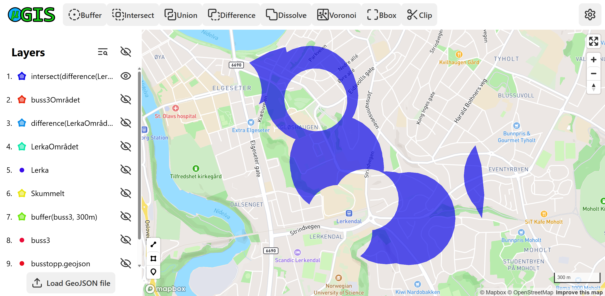

#  Tutorial: Finding Good Housing Locations for Students in Trondheim

## 🎯 Objective

In this tutorial, we'll use GIS tools to help identify **suitable places to live for a student in Trondheim**, based on access to public transport, proximity to campus and safety concerns.

### 🧩 Criteria

We are looking for housing areas that meet the following conditions:

- 🧭 Within **1 km** of Lerkendalsbygget, NTNU Gløshaugen
- 🚌 Within **300 meters** of **bus route 3**
- 🚫 At least **200 meters away** from underpasses (considered potentially unsafe)

---

## 🗂️ Data Used

Ensure the following GeoJSON files are available in your project:

- `busstopp.geojson`: locations of all bus stops, with an attribute `bus_lines` indicating which bus lines serve each stop.
- `undergang.geojson`: locations of underpasses.

---

## 🛠️ Step-by-Step Workflow

### 1. Load the Data

1. Open muGIS in your browser.
2. Click on the **Load GeoJSON file** button in the bottom of the sidebar to the left.
   - Alternatively, you can drag and drop the files directly into the application window.
3. Load the two GeoJSON files (can be found in the `docs/tutorial-data/` folder):
   - `busstopp.geojson`
   - `undergang.geojson`

---

### 2. Identify Stops Served by Bus Line 3

1. Open the **Attribute Table** of `busstopp.geojson`. This can be done two ways:
   - Click the  icon in the sidebar and select the `busstopp.geojson` layer.
   - Click the  icon on the `busstopp.geojson` layer in the sidebar, and then click **"Attribute Table"**.
2. Press the **"Open Filter"** button to open the filter panel.
3. Set "Combine filters by:" to `"or"` so that any of the conditions can be true.
4. Find all bus stops with line 3 by using these four filters (with spaces as shown):
   ```
   bus_lines = '3'
   bus_lines starts with '3,'
   bus_lines contains ' 3,'
   bus_lines ends with ' 3'
   ```
   - Click **"Add Filter"** to add more filters as needed.
   - Check the checkbox next to each filter to apply it.
5. Select all matching features (click the select button in the table’s corner to select all filtered featuers).
6. Click **"Create Layer From Selected Features"**.
   - This creates a new layer containing only the bus stops served by line 3.
   - The new layer (named `selection(busstopp.geojson)`) will appear at the top of the Layers list.
7. Rename the new layer to **`buss3`**.

---

### 3. Create Buffers

1. Create a **300 meter buffer** around the `buss3` layer by using the **Buffer** tool in the toolbar.
   - This shows areas easily reachable from bus line 3.
2. Create a **200 meter buffer** around `undergang.geojson`.
   - Rename this buffer to **`Skummelt`**.

---

### 4. Simplify the View

1. Hide all the layers to see the map clearly. Press the topmost **eye icon** in the sidebar.

---

### 5. Create a Reference Point for Lerkendalsbygget

1. Activate *Point drawing mode* by clicking the marker icon in the bottom right of the map. 
   <br>
2. Now click on the map to place a point at the location of *Lerkendalsbygget* (NTNU Gløshaugen).
   <br>
3. Rename this point to **`Lerka`**.

---

### 6. Create a Search Area Around Lerka

1. Create a **1000 meter buffer** around the `Lerka` point.
   - Rename this buffer to **`LerkaOmrådet`**.

---

### 7. Exclude Unsafe Areas

1. Use the **Difference** tool to subtract unsafe areas:
   - Input: `LerkaOmrådet`
   - Subtract: `Skummelt`
   - Output: a safe area around Lerka with underpasses excluded.

---

### 8. Refine the Bus Area

1. Use **Dissolve** on the `buffer(buss3, 300m)` layer to merge all the overlapping features into one.
   - This simplifies the bus area into a single polygon.
   - Rename this layer to **`buss3Området`**.

---

### 9. Find the Final Suitable Zone

1. Open the **Intersect** tool:
2. Select the input layers: 
   - the result from the **Difference** operation (`difference(LerkaOmrådet, Skummelt)`).
   - `buss3Området`
3. Output: area that is:
   - Within walking distance to Studentersamfundet (via Lerka)
   - Near bus line 3
   - Away from scary underpasses

🎉 **Done!** You've now isolated suitable places to live for students in Trondheim using spatial analysis.

